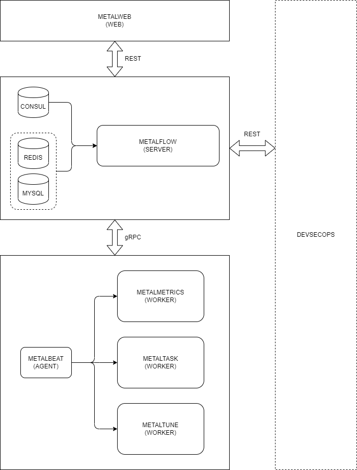

# metaltask

[](https://github.com/craftslab/metaltask/actions?query=workflow%3ACI)
[](https://github.com/craftslab/metaltask/blob/master/LICENSE)
[](https://github.com/craftslab/metaltask/tags)


## Introduction

*metaltask* is a worker of *[metalflow](https://github.com/craftslab/metalflow/)* written in Rust.


## Prerequisites

- Rust >= 1.52.0


## Run

```bash
./metaltask --config-file="config.yml" --listen-url="127.0.0.1:9090"
```


## Usage

```
USAGE:
    metaltask --config-file <NAME> --listen-url <URL>

OPTIONS:
    -c, --config-file <NAME>    Config file (.yml)
    -h, --help                  Print help information
    -l, --listen-url <URL>      Listen url (host:port)
    -V, --version               Print version information
```


## Settings

*metaltask* parameters can be set in the directory [config](https://github.com/craftslab/metaltask/blob/master/src/config).

An example of configuration in [config.yml](https://github.com/craftslab/metaltask/blob/master/src/config/config.yml):

```yaml
apiVersion: v1
kind: worker
metadata:
  name: metaltask
spec:
  task:
    clean: true
    path: /tmp
```


## Design




## License

Project License can be found [here](LICENSE).


## Reference

- [rust-grpc](https://gist.github.com/craftslab/c1b0e5c7f670d6f42a3623d04fddf8c1)
